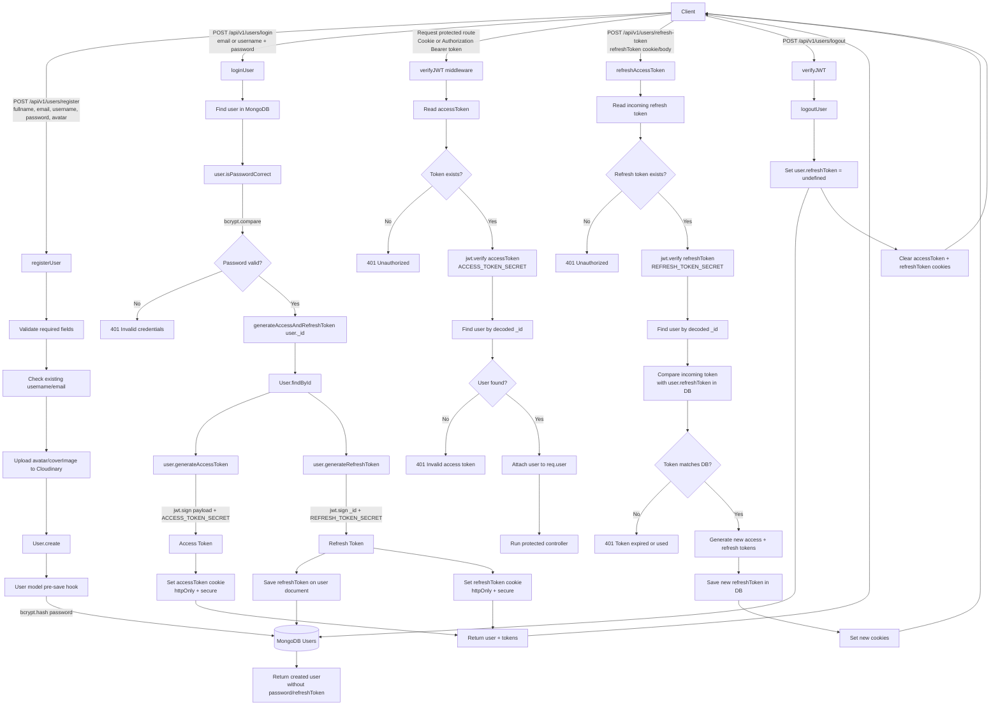
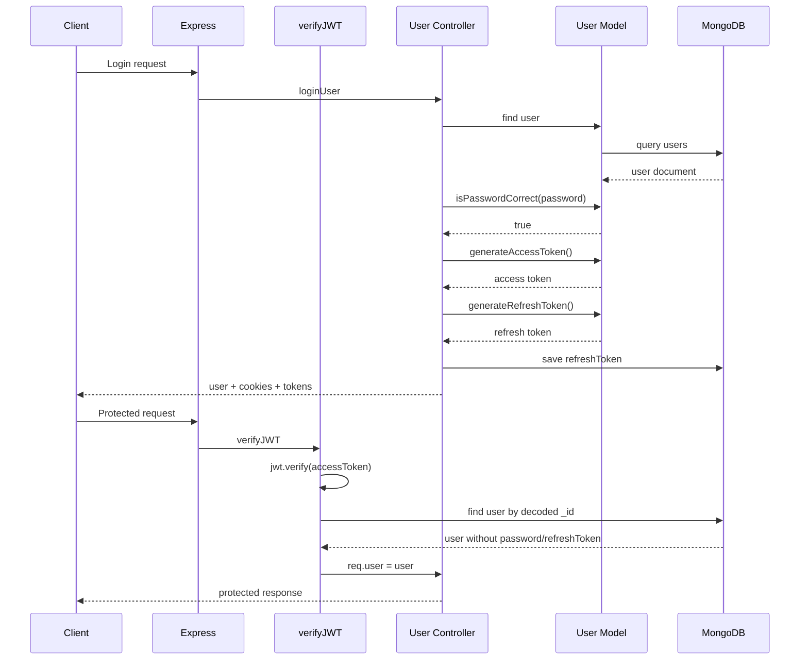
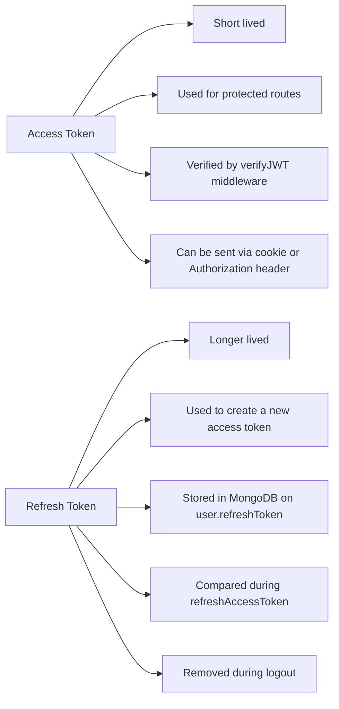

# JWT Authentication Flow

This diagram follows the authentication model implemented in this codebase:

- `User` model methods create JWTs with `jwt.sign(...)`
- `loginUser` sends tokens to the client
- `verifyJWT` protects secured routes
- `refreshAccessToken` verifies the stored refresh token
- `logoutUser` clears the refresh token from the database

## Mental Model

## Token Responsibilities

